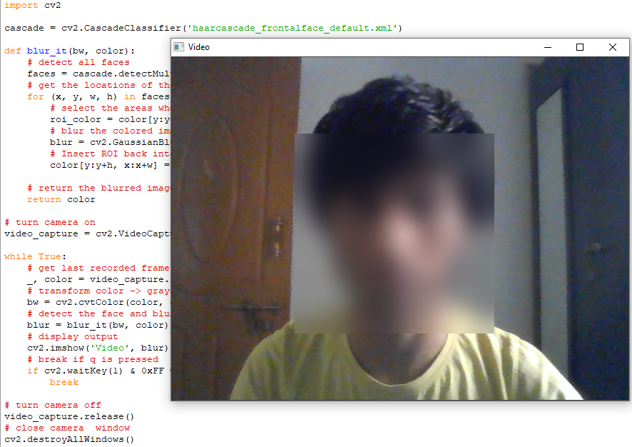

# FaceBlurr

## Introduction

This project aims to Blur the person's Face in Realtime and is able to detect multiple faces and blur it. **Gaussian Blur** is used to Blur the coloured Image and **detectMultiScale** is used to detect Multiple Faces. **Haar Cascade classifiers** are used and is an effective way for object and Face detection.

## Dependencies

* [Python 3](https://www.python.org/)
*  [OpenCV](https://opencv.org/)

If you dont have Python installed in your PC ,it can be installed from here [python](https://www.python.org/downloads/).

Hit the command in CMD/Terminal if you don't have it already installed:

    pip install opencv-python

   (OR)
   
 Install OpenCV via anaconda
  
    conda install -c menpo opencv
    
## How to run the code
Clone the Repository and extract the files

1. Go to the folder where .py file is present
2. Type cmd in the file path 
2. Run the code with command `python realtime_face_blur.py`
3. Press Q to exit the window
4. This can also done without running the code by just clicking `realtime_face_blur.exe` present in `realtime_face_blur` folder.
5. Ensure that `haarcascade_frontalface_default.xml` is in the same working directory 

## Algorithm

* Fisrt, We get the last recorded Frame and transform the color to grayscale

* The **haar cascade** method is used to detect faces in each frame of the webcam feed.

* We get the location of face with help of Coordinates.

* The **GaussianBlur** method is used to Blur the colored image in the area where the face is found.

* Then ROI is inserted back into the image and blurred image is returned. 

## Example Output

